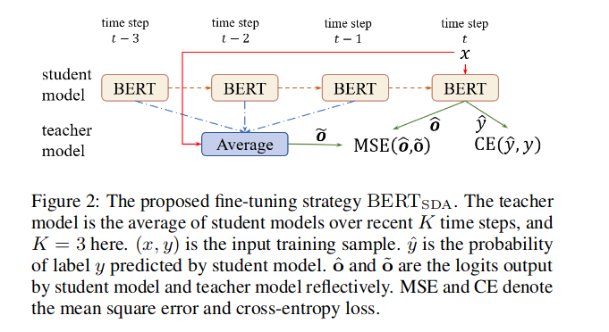

## BER-SDA

A PyTorch implementation of "Improving BERT Fine-Tuning via Self-Ensemble and Self-Distillation"

paper: https://arxiv.org/pdf/2002.10345.pdf

### Structure of the model

The author improve thefine-tuning of BERT with two effective mechanisms:self-ensembleandself-distillation. The experimentson text classification and natural language inferencetasks show our proposed methods can significantlyimprove the adaption of BERT without any externaldata or knowledge.



### requirement

1. pytorch=1.3.0
2. cuda=9.0

### How to use the code

```shell
CURRENT_DIR=`pwd`
export BERT_BASE_DIR=$CURRENT_DIR/prev_trained_model/berta-base
export GLUE_DIR=$CURRENT_DIR/datasets
export OUTPUR_DIR=$CURRENT_DIR/outputs
TASK_NAME="tnews"

python run_classifier.py \
  --model_type=bert \
  --model_name_or_path=$BERT_BASE_DIR \
  --task_name=$TASK_NAME \
  --do_train \
  --do_eval \
  --do_kd \
  --do_lower_case \
  --data_dir=$GLUE_DIR/${TASK_NAME}/ \
  --max_seq_length=128 \
  --per_gpu_train_batch_size=16 \
  --per_gpu_eval_batch_size=16 \
  --learning_rate=2e-4 \
  --num_train_epochs=6.0 \
  --logging_steps=3335 \
  --save_steps=3335 \
  --output_dir=$OUTPUR_DIR/${TASK_NAME}_output/ \
  --overwrite_output_dir \
  --seed=42
```

